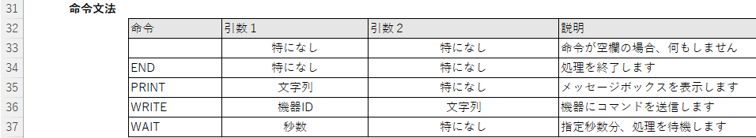
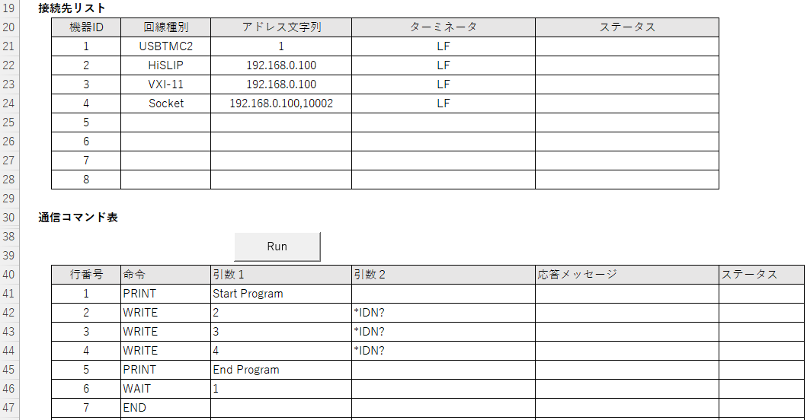

[English](README.md) | [日本語](README.ja.md)

# エクセルコマンドとは
エクセルコマンドは測定器を簡単に制御するためのオープンソースソフトウェアです。
エクセルファイルに通信コマンドを記入し、各種通信インタフェースで送受信することができます。
測定器との通信を確認するためのジグプログラムとして使う事を想定しています。最終的に校正証明書を素早く作成できるソフトウェアを目標にしています。

# 特徴
- Excel VBA（表計算マクロ言語）と付属の通信ライブラリ (TMCTL.DLL) で動作します。
  - インストール作業は不要です。ダウンロードしてすぐに使うことができます
  - GP-IBまたはUSBを使う場合は各ベンダーのデバイスドライバをインストールする必要があります。
- 測定器と GP-IB、RS232、USB、Ethernet で通信できます。
- 最大8台の測定器の制御や計測ができます。
- 日本語表記と英語表記に対応しています。

# 動作環境
- OS：Windows 2000, XP, Vista, 7, 8, 10, 11
- Excel：2010, 2013, 2016, 2019, 2021
  - Office for Mac や Microsoft 365 は非対応です。

# 対象機器
- IEEE488.2-1987 に対応する測定器

# 通信インタフェース
- GP-IB：ナショナルインスツルメンツ製 GP-IB インタフェースが動作する環境。
  - 別途 [NI-488.2](https://www.ni.com/ja-jp/support/downloads/drivers/download.ni-488-2.html) をインストールしてください。
- RS232C：シリアルポート又は仮想COMポートが動作する環境。
- Ethernet：ソケット通信、VXI-11 または HiSLIP が動作する環境。
- USB：ナショナルインスツルメンツ製 NI-VISA または　横河計測製 USB ドライバが動作する環境。
  - 別途 [NI-VISA](https://www.ni.com/ja-jp/support/downloads/drivers/download.ni-visa.html) または[横河計測製 USB ドライバ](https://tmi.yokogawa.com/jp/library/documents-downloads/software/usb-drivers/)をインストールしてください。

# 使い方
## ダウンロードと展開
ZIP ファイルをダウンロード後にファイルを展開し、ExcelCommand.xlsm, tmctl.dll, tmctl64.dll, YKMUSB.dll, YKMUSB64.dll の5個のファイルを同一ディレクトリに置いてください。

## マクロを含むブックを開く
Excel の初期の設定ではマクロを含むブックを開こうとすると、セキュリティの警告を表示してマクロを無効にします。マクロを有効に設定する方法は、次の通りです。

- 「ファイル」タブをクリックし、「オプション」をクリック
- 左側の一覧から「セキュリティセンター」をクリックし、 「セキュリティセンターの設定」をクリック
- 左側の一覧から「マクロの設定」をクリック
- 「マクロの設定」の一覧から「VBAマクロを有効にする」をクリック

## アドレス文字列

## 命令

## 記入例

# 著作権表記
Excel Commmand: An excel macro file to communicate some measurement insturuments.

Copyright (C) 2023 Takatoshi Yamaoka

Licensed under the Apache License, Version 2.0 (the "License");
you may not use this file except in compliance with the License.
You may obtain a copy of the License at

    http://www.apache.org/licenses/LICENSE-2.0

Unless required by applicable law or agreed to in writing, software
distributed under the License is distributed on an "AS IS" BASIS,
WITHOUT WARRANTIES OR CONDITIONS OF ANY KIND, either express or implied.
See the License for the specific language governing permissions and
limitations under the License.
