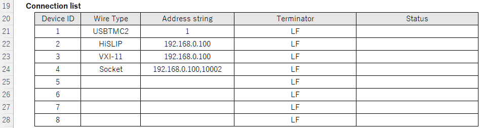
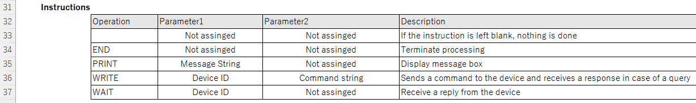
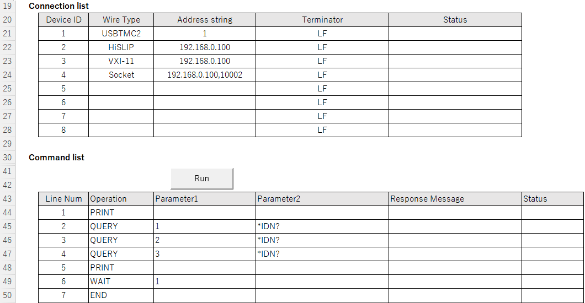

[日本語](README.ja.md) | [English](README.md)

# about Test Sequencer
Test Sequencer is an open source software for easy control of measurment instruments. 
Communication commands can be written in an Excel file and sent and received by various communication interfaces. 
It is intended to be used as a jig program to check the communication with the measurement instruments. 

# Features
- Works on Excel VBA and commucation library. 
- Communicates with measurment instruments via GP-IB, RS232, USB, or Ethernet.
- Controls up to eithgt measurment instruments.
- Japanese, English, Chinese and Korean text can be switched.
- You do not need to install third party software. You can use it immediately after download.
  - If using GP-IB or USB, device drivers is needed.

# Operating environment
**Bolded** are tested environments. For other environments, I would appreciate a report.
- OS：Windows XP, Vista, 7, **10**, **11**
- Excel：2010, 2013, 2016, **2019**, 2021
  - Office for Mac and Microsoft 365 are not supported.
- Note: if you want to run on 64-bit version of Excel.
- Note: If you use GP-IB communication, install [NI-488.2](https://www.ni.com/ja-jp/support/downloads/drivers/download.ni-488-2.html).
- Note: When using USB communication, install [NI-VISA](https://www.ni.com/ja-jp/support/downloads/drivers/download.ni-visa.html) or [Yokogawa USB driver](https://tmi. yokogawa.com/jp/library/documents-downloads/software/usb-drivers/).

# Target devices
- Measurment instruments compliant with IEEE488.2-1987

# Communication interface
- GP-IB: Environment in which National Instruments GP-IB interface works.
  - Please install [NI-488.2](https://www.ni.com/ja-jp/support/downloads/drivers/download.ni-488-2.html).
- RS232C: Environment in which serial port or virtual COM port operates.
- Ethernet: Socket communication, VXI-11, or HiSLIP must work.
- USB: Environment where National Instruments NI-VISA or Yokogawa Measurement USB driver works.
  - Please install [NI-VISA](https://www.ni.com/ja-jp/support/downloads/drivers/download.ni-visa.html) or [Yokogawa USB driver](https://tmi.yokogawa.com/jp/library/documents-downloads/software/usb-drivers/) separately.

## How to use
## Download and Extract
After downloading the ZIP file, extract the 5 file (ExcelCommand.xlsm, tmctl.dll, tmctl64.dll, YKMUSB.dll and YKMUSB64.dll), and place these files in the same directory.

## Open a book containing macros
By default Excel displays a security warning and disables macros when you try to open a book containing macros. To enable macros, follow these steps

- In an Excel program, on the File tab, click Options.
- Click Trust Center, and then click Trust Center Settings. The following screen is an example from
- Click "Macro Settings".
- Select "Enable VBA macros" from the "Macro Settings" list

## Address string

## Instruction

## Example

## Copyright
Test Sequencer: An macro file to communicate some measurement insturuments.

Copyright (C) 2023 Takatoshi Yamaoka

Licensed under the Apache License, Version 2.0 (the "License");
you may not use this file except in compliance with the License.
You may obtain a copy of the License at

    http://www.apache.org/licenses/LICENSE-2.0

Unless required by applicable law or agreed to in writing, software
distributed under the License is distributed on an "AS IS" BASIS,
WITHOUT WARRANTIES OR CONDITIONS OF ANY KIND, either express or implied.
See the License for the specific language governing permissions and
limitations under the License.
